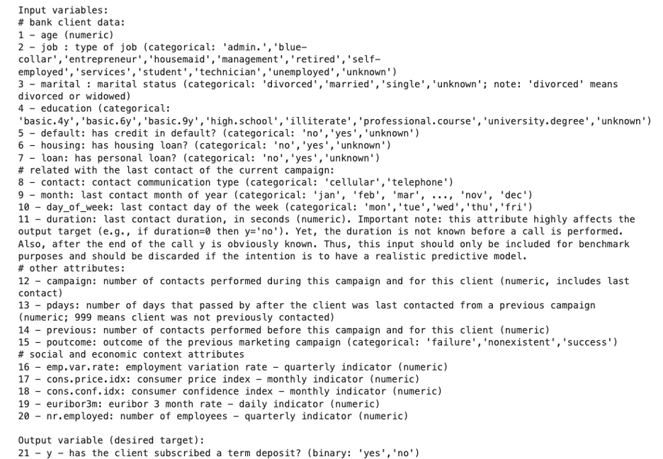
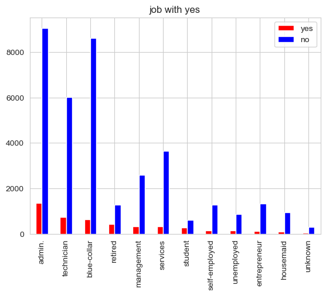
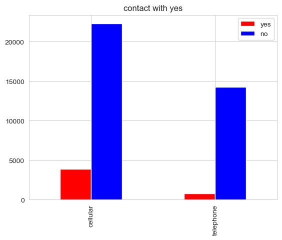

# Comparing Classifier in data analysis of a Portuguese Marketing Campaign using Bank Marketing data Set

## Context

In this project we analyzed data from UCI Machine Learning Repository called Bank Marketing Data Set. The data is related with direct marketing campaigns of a Portuguese banking institution. The marketing campaigns were based on phone calls. Often, more than one contact to the same client was required, in order to access if the product (bank term deposit) would be (’yes’) or not (’no’) subscribed. There were available four datasets, we chose ‘bank-additional-full.csv’ data set, which with all examples (41188) and 20 inputs, ordered by date (from May 2008 to November 2010), very close to the data analyzed in

## Goal

In this third practical application assignment, our goal is to compare the performance of the next classifiers:
- k-nearest neighbors 
- logistic regression
- decision trees 
- support vector machines 

## Jupiter Notebook
### Content

### Problem 1: Understanding the Data
We use a Python script that imports several libraries and sets some configurations for data visualization using NumPy, Matplotlib, Seaborn, and handles warnings from future versions of libraries.

This code sets up the environment for data visualization using Seaborn, configures some aesthetic preferences like color palettes and plot styles, and suppresses future warning messages that might be generated by certain libraries. This can be useful when we want to create visually appealing plots and ensure a clean output in our Python script.

### Problem 2: Read in the data

Our data contains 41188 observations of 21 features, where are 11 categorial features and 10 numeric features. 

*Example of data set.*

### Problem 3: Understanding the Features

We use “info” method to know the data structure of this data set, all 41188 rows with non-null value.

Then we used “describe” method to get statistical information about this data set and dataset’s features belong to. Based on those we have best approach analysis, missing value, “unknown” data cleaning and transforming for target solution.

 

### Problem 4: Understanding the Task

Business objective of the task is finding the classifier model which is able to support the Prortugal bank to offer customer to get deposit product.  

*Preprocessing* 

Next step we clone new data set named “temp_data” for EDA (Exploring Data Analysis) , then we collected metadata of data set’s features. Which categorical columns we encoded for digitalize and exporing data by applying quantities analysis with target value (y), Encoding categorical data is necessary to convert text-based categories into numerical values that can be used in training models.

Here are the columns which were selected for encoding: job, marital, education, default, housing, loan, contact, month, day_of_week, poutcome, y.

For numeric features, we approach histogram to show distribution feature values for determining outlier of each feature for reducing bias for feature value for model training. These are list of numeric features in dataset “duration, campaign, pdays, previous, poutcome, emp.var.rate, cons.price.idx, cons.conf.idx, euribor3m,nr.employed”

Then we calculated correlation of each feature with target column value “y”

We can see that the features with correlation coefficient higher than 0.29 are: 
- duration
- nr.employed 
- pdays
- euribor3m
- emp.var.rate

And in graphical representation:

Next step we create histograms to visualize the distribution of numeric variables in a DataFrame using Python. These histograms will help us understand the distribution and characteristics of the data. 

Now our code is set up to visualize how the 'yes' values are distributed across different categories in the categorical columns, providing a visual representation of the relationship between categorical features and the binary outcome 'y'.

We try to visualize the relationship between categorical columns and the target variable 'y' by creating grouped bar plots for each categorical column, showing how 'yes' and 'no' values are distributed across the categories.

|  |  |  |
| -- | -- | -- |
|  |  |  |
|  |  |  |
|  |  |  |
 
We are exploring “Age” feature

We are going to remove outliers and missing values for numeric variables

### Problem 5: Engineering Features

Now understanding our business objective, we will build a basic model to get started. Before we can do this, we must work to encode the data Using just the bank information features (columns 1 - 7), prepare the features and target column for modeling with appropriate encoding and transformations.

We are replacing ‘unknown’ by NaN then using fill missing value by most value of feature occur in data set.
   
These are list of features applied for cleaning data are :[ marital, job] 

Next we using statistic to identifying all variables with great predictive power (Pearson Correlation p-value) for reducing feature using for training model 

### Problem 6: Train/Test Split

### Problem 7: A Baseline Model 
We using basic model  Logistic Regression, Decision Trees as based line models

### Problem 8: A Simple Model 
#### Logistic Regression

#### DecisionTreeClassifier

### Problem 9: Score the Model 
After we collected baseline model, we define 4 models with hyper parameters for each to training and find out which are best model to resolve the problem

 

The scores of 1st time training are collected and show below, we show both AUC and Confusion Matrix for classification for easy to find best algorithm based on Label /Target value scores

 
### Problem 10: Model Comparisons
#### Best Model 

‘Decision tree’ is the best classifier model with training score 0.939272, test score 0.908230
‘Nearest Neighbors’ is the second classifier model with training score 0.899272, test score 0.900825

 
### Problem 11: Improving the Model

Now that we have some basic models on the board, we want to try to improve these. Below, we list a few things to explore in this pursuit.
- More feature engineering and exploration. For example, should we keep the gender feature? Why or why not? 
    
    Current, dataset don’t have gender features, in case it’s have maybe we don’t need because the gender maybe make algorithm result bias as same as gender sample data supervised 
- Hyperparameter tuning and grid search. All of our models have additional hyperparameters to tune and explore. For example the number of neighbors in KNN or the maximum depth of a Decision Tree. We did to change and turning hyperparameters and get more accuracy and time for training, cost for training deduced

    

## Conclusion
1. Reduced features based on correated with target not impacted score of model, so that computing performance better with score as well
2. Additional increase parameter for models (p_seed = 256,p_max_iter = 300,p_n_neighbors =1500 ,p_max_depth =15 ) could get better score of models
3. Based on resuls above, Decision Tree classifier model are best choice with training time
4. Alternate model could be Linear SVM but traing time too long as Logistic Regression.

